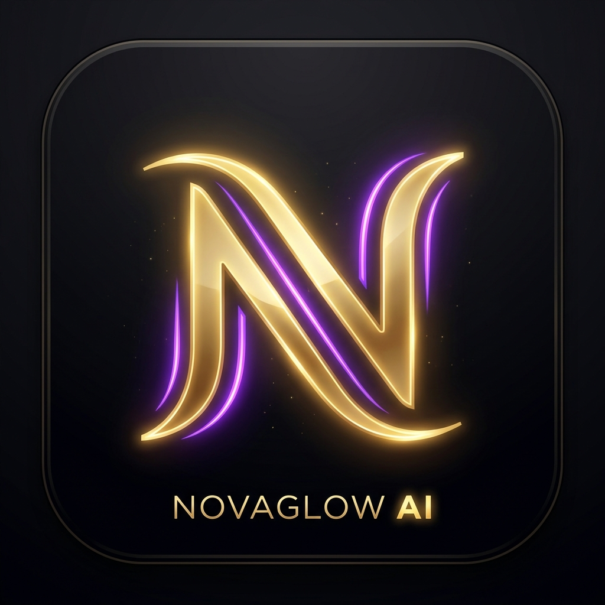
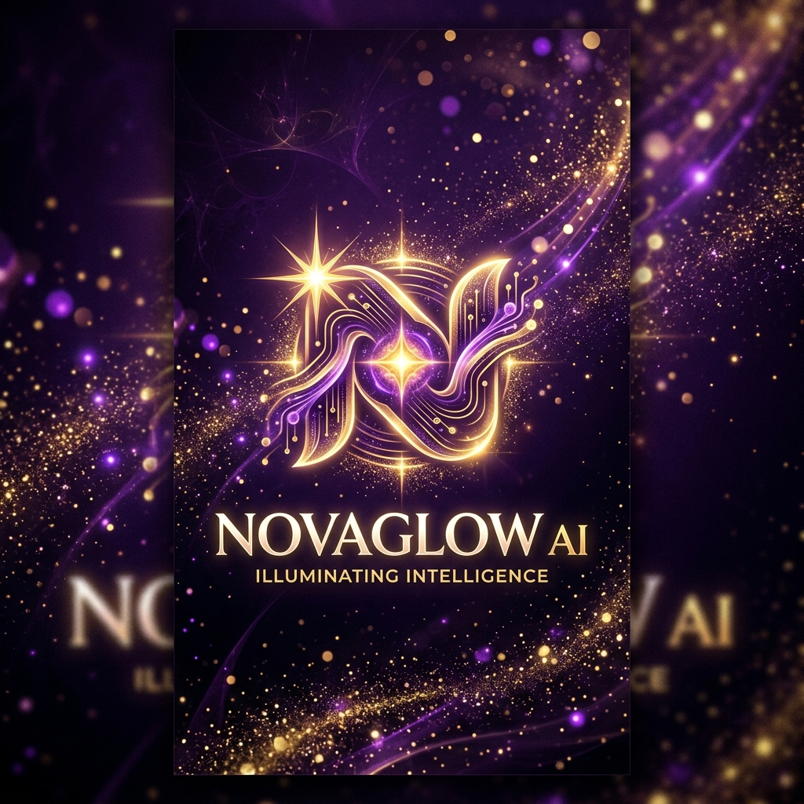
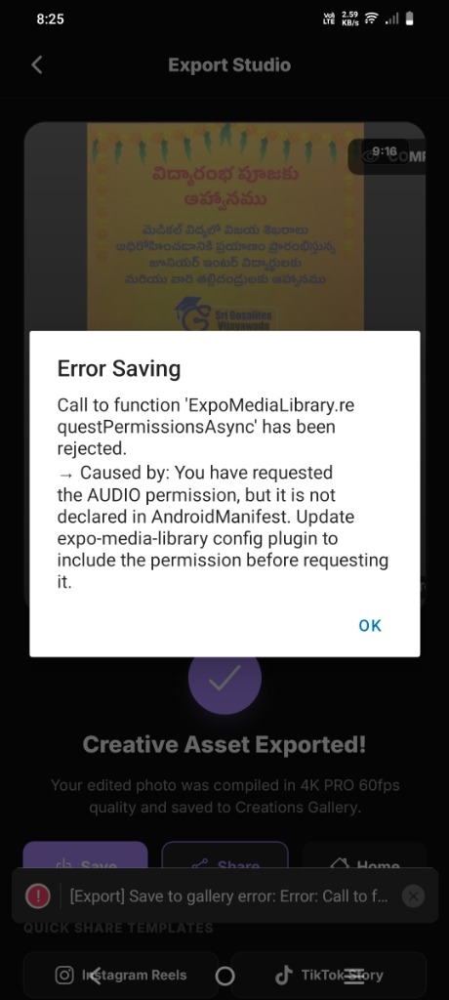
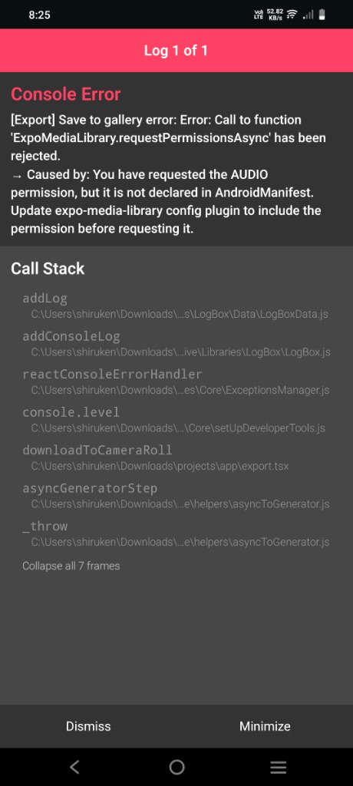
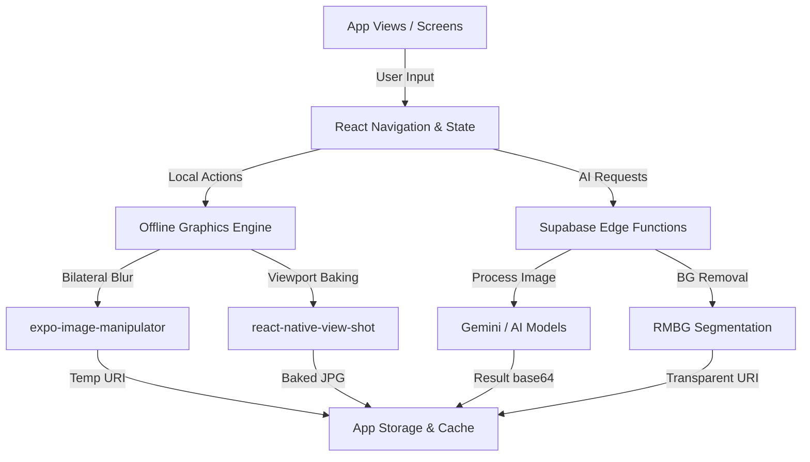

# NovaGlow AI

<p align="center">
  
</p>

<h3 align="center">NovaGlow AI</h3>

<p align="center">
  A premium, high-fidelity mobile creative studio built with React Native and Expo. Experience local-first photo manipulation, AI backdrop replacement, real-time filters, and layout stories in a modern, dark-themed interface.
</p>

<p align="center">
  
  
  
  
</p>

---

## 🎨 Hero Visual

<p align="center">
  
</p>

---

## 📱 Features

NovaGlow AI is designed with a reliable dual-mode execution strategy. It functions in offline mode using client-side graphics engines, and connects to high-performance AI models when the Supabase backend is configured.

### Feature Matrix

| Feature | Local MVP Engine | AI Backend Capability | Status |
| :--- | :--- | :--- | :--- |
| **Beauty Studio** | Retouch sliders, smoothing, bilateral skin filters, eye widen | Multi-point face landmarks, advanced morphs | **Functional** ✅ |
| **Background Swap** | Local backdrop composition, vignetted framing presets | Automatic background segmentation (Supabase RMBG-1.4) | **Functional** ✅ |
| **Object Eraser** | Multi-touch brush masking, dynamic radius box-blur healing | Stable Diffusion Inpainting / Fills | **Functional** ✅ |
| **AI Avatar** | Style-specific image manipulation (`expo-image-manipulator`) | Text-to-image Gemini multi-style generation | **Functional** ✅ |
| **AI Story** | magazine, retro, neon, influencer carousels with overlays | Layout auto-generation | **Functional** ✅ |
| **Compare Mode** | Real-time viewport opacity toggle (before/after) | N/A | **Functional** ✅ |
| **Export/Share** | High-fidelity canvas rendering (`react-native-view-shot`) | N/A | **Functional** ✅ |

---

## 📸 Screenshots

<p align="center">
  
  
  
</p>

---

## 🛠️ Architecture



### Key Modules

- **`app/editor.tsx`**: The main creator workspace containing filters, retouching control loops, touch-event canvas handlers, and viewport baking logic.
- **`lib/api.ts`**: The communication gateway supporting local fallback and remote Supabase invocation.
- **`lib/imageProcessing.ts`**: Robust conversion routines protecting against base64 failures and handling download queues.
- **`lib/mediaUtils.ts`**: Safe copy-to-storage handlers and verification tools keeping user media isolated.

---

## 🚀 Getting Started

### Prerequisites

* Node.js v20 LTS or later
* npm or yarn
* iOS Simulator (macOS + Xcode) or Android Emulator (Android Studio)
* Expo Go application (for physical device testing)

### Installation

1. **Clone the Repository**
   ```bash
   git clone https://github.com/praveen131106/ai-editor-clone.git
   cd ai-editor-clone
   ```

2. **Install Dependencies**
   ```bash
   npm install
   ```

3. **Verify Environment Configuration**
   Copy the example environment file and adjust keys if you are deploying the backend:
   ```bash
   cp .env.example .env
   ```

4. **Start the Development Server**
   ```bash
   npx expo start -c
   ```

### Execution Options

* Press **`i`** to open in the iOS Simulator.
* Press **`a`** to open in the Android Emulator.
* Scan the QR code on your terminal using your phone camera (iOS) or the Expo Go App (Android).

---

## 🔒 Security & Verification

* **Secrets & Keys**: All API keys, endpoint configurations, and credentials are kept out of the repository. `.env` and `.env.local` are explicitly blocked in `.gitignore`.
* **Static Analysis**: TypeScript compilations and Jest verification test suites are integrated to prevent runtime failures.
* **Base64 Crash Prevention**: Highly sensitive API paths utilize optional chaining and safe base64 decoding utilities to shield the app from runtime crashes.

---

## 📄 License

This project is licensed under the MIT License - see the [LICENSE](LICENSE) file for details.
